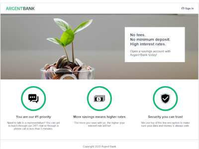
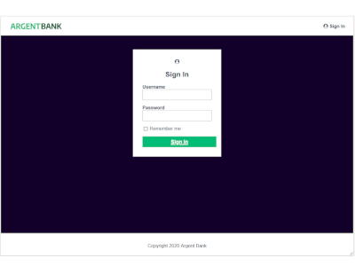

# Utilisez une API pour un compte utilisateur bancaire avec React

Création d'une application web React pour un système d'authentification utilisateur. Connection à la base de données avec un Token jws généré par l'API Back-end.

Conversion de l'ancien design HTML en react.

## Prérequis

- 
  
  

Le back-end se trouve à [https://github.com/OpenClassrooms-Student-Center/Project-10-Bank-API](https://github.com/OpenClassrooms-Student-Center/Project-10-Bank-API). Il utilise `Node.js v12` !
Suivre le ReadMe pour mettre en place la bdd (Mongo) et l'API.

## Scripts

Une fois la bdd connectée et l'API Back-end lancée sur le port local 3001 (`npm run dev:server`),

### `npm start`

Pour lancer l'App en mode développement, sur le port local 3000 par défaut :
[http://localhost:3000](http://localhost:3000) pour accéder dans le navigateur.

## Technologies

- 
  
- 
  
- 

## Ressources

- Les fichiers html statiques et le css de l'ancien design sont fournis comme tramme de départ.
  
  
  

- La technologie JWT de Token encrypé (RCF 7519) est consultable sur [https://jwt.io/](https://jwt.io/)

## Fonctionnalités de la phase authentification

- _L'utilisateur peut visiter la page d'accueil_
  La page root `/` est accessible

- _L'utilisateur peut se connecter au système_
  La page `/sign-in` est accessible, le formulaire de connection attend la saisie utilisateur
  La validation de la saisie entraîne la vérification du couple email/mdp par l'API
  Après vérification positive, envoi d'un token jws et navigation vers `/user`
  Si l'utilisateur choisi de conserver l'authentification, le token est sauvegardé en localStorage
  Après vérification négative, retour sur root `/`

- _L'utilisateur peut se déconnecter du système_
  Le header affiche un bouton de déconnexion
  Un clic sur le bouton renvoie sur la page root `/`
  Le token stocké en localStorage ou SessionStorage est remis à zéro

- _L'utilisateur peut modifier le profil et conserver les données dans la base de données._
  Le endpoint /user/profile PUT avec une authentification par token permet à l'API de modifier la bdd

- _Utilisation de Redux pour la gestion du store_
  Redux et Redux-toolkit prennent en charge le store, avec actions et reducers

